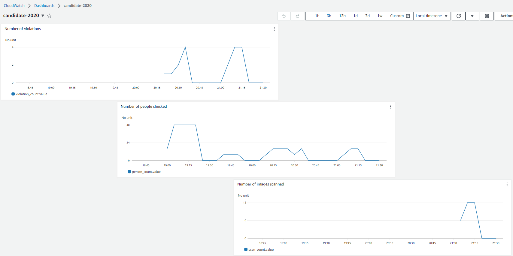

# Besvarelse kandidat-2020
## Kort Info fra Kandidat 2020

Dette dokumentet er ment som en ekstra guide til sensor.

* ***Hvis jeg siterer en oppgave fra eksamens teksten er den skrevet som dette***

Hvis det skrevet som dette, er det skrevet av Kandidat-2020

## Oppgave 1 Kjells Python kode
### Del A

* ***Fjerne hardkoding av S3 bucket navnet app.py koden, slik at den leser verdien "BUCKET_NAME" fra en miljøvariabel.***

Henter BUCKET_NAME fra en enviorment variable i template.yaml

```python
BUCKET_NAME = os.environ.get("BUCKET_NAME")
```

```yaml
 Environment:
        Variables:
          BUCKET_NAME: "kandidat-2020"
```

<br>

* ***Du skal opprette en GitHub Actions-arbeidsflyt for SAM applikasjonen. For hver push til main branch, skal arbeidsflyten bygge og deploye Lambda-funksjonen.***
* ***Som respons på en push til en annen branch en main, skal applikasjonen kun bygges***


Jeg tok utgangspunkt i workflow filen vi brukte i [CD-AWS-lamda-sls øvingen](https://github.com/glennbechdevops/02-CD-AWS-lamda-sls#github-actions)

Min GitHub Action fil ligger [her](.github/workflows/sam-deploy.yml)


* ***Forklar hva sensor må gjøre for å få GitHub Actions workflow til å kjøre i sin egen GitHub-konto***

For at sensor skal kjøre workflow fra sin egen fork må sensor lage egne Repository Secrets
1. Gå in på AWS IAM
2. Trykk Create Access Keys
3. Kopier Key og Secret Key
4. Gå til GitHub Repoet og legg til «New Repository Secrets»


### Del B
* ***Lag en Dockerfile som bygger et container image du kan bruke for å kjøre python koden***

Jeg tok utgangspunkt fra Dockerfilen i denne [guiden](https://www.docker.com/blog/how-to-dockerize-your-python-applications/)

Min Dockerfile ligger [her](kjell/hello_world/Dockerfile)

## Oppgave 2 Overgang til Java og Spring Boot
### Del A
* ***Lag en Dockerfile for Java-appliksjonen. Du skal lage en multi stage Dockerfile som både kompilerer og kjører applikasjonen***

Jeg brukte samme Dockerfil som vi brukte i [spring-docker-dockerhub øvingen](https://github.com/glennbechdevops/spring-docker-dockerhub#dockerize--en-spring-boot-applikasjon-og-push-til-docker-hub)

Min Dockerfile ligger [her](Dockerfile)


### Del B
* ***Lag en GitHub actions workflow som ved hver push til main branch lager og publiserer et nytt Container image til et ECR repository.***
* ***Workflow skal kompilere og bygge et nytt container image, men ikke publisere image til ECR dersom branch er noe annet en main.***
* ***Du må selv lage et ECR repository i AWS miljøet, du trenger ikke automatisere prosessen med å lage dette.***
* ***Container image skal ha en tag som er lik commit-hash i Git, for eksempel: glenn-ppe:b2572585e.***
* ***Den siste versjonen av container image som blir pushet til ECR, skal i tillegg få en tag "latest"***

Jeg tok utgangspunkt i workflow fila fra [spring-docker-dockerhub øvingen](https://github.com/glennbechdevops/spring-docker-dockerhub#f%C3%A5-github-actions-til-%C3%A5-bygge--pushe-et-nytt-image-hver-gang-noen-lager-en-ny-commit-p%C3%A5-main-branch)

Min GitHub Action Workflow fil ligger [her](.github/workflows/docker.yml)

Containerne blir pushet til AWS ECR repoet kandidat-2020

## Oppgave 3- Terraform, AWS Apprunner og Infrastruktur som kode
### Del A
* ***Fjern hardkodingen av service_name, slik at du kan bruke ditt kandidatnummer eller noe annet som service navn***
* ***Se etter andre hard-kodede verdier og se om du kan forbedre kodekvaliteten***
* ***Se på dokumentasjonen til aws_apprunner_service ressursen, og reduser CPU til 256, og Memory til 1024 (defaultverdiene er høyere***

``aws_iam_policy`` ``aws_iam_role`` ``image_identifier`` og ``service_name`` henter variabler fra  [variables.tf](infra/variables.tf)


```tf
variable "kandidat" {
  type = string
}

variable "image" {
  type = string
}
```

Jeg prøvde å følge dokmunetasjonen til CPU og Memory i [dokumentasjonen](https://registry.terraform.io/providers/hashicorp/aws/latest/docs/resources/apprunner_service#instance-configuration) til aws_apprunner_service, men fikk rare feilmeldinger når jeg prøvde å sette egne cpu og memory verdier, jeg kar kommentert ut koden slik jeg ville ha gjort det i min main.tf [fil](infra/main.tf)

```tf
  instance_configuration {
    instance_role_arn = aws_iam_role.role_for_apprunner_service.arn
    #cpu = "256"
    #memory = "1024"
  }
```


### Del B
* ***Utvid din GitHub Actions workflow som lager et Docker image, til også å kjøre terraformkoden***
* ***På hver push til main, skal Terraformkoden kjøres etter jobber som bygger Docker container image***
* ***Du må lege til Terraform provider og backend-konfigurasjon. Dette har Kjell glemt. Du kan bruke samme S3 bucket som vi har brukt til det formålet i øvingene***
* ***Beskriv også hvilke endringer, om noen, sensor må gjøre i sin fork, GitHub Actions workflow eller kode for å få denne til å kjøre i sin fork***

Jeg tok utgangspunkt i Workflow og terraform koden i [Terraform-app-runner øvingen](https://github.com/glennbechdevops/terraform-app-runner)

Min oppdaterte GitHub workflow fil for Terraform ligger [her](.github/workflows/docker.yml)

Min terraform provider og backend-konfigurasjon ligger i [provider.tf](infra/provider.tf)

Her trenger sensor GitHub Repository Secrets for å kjøre GitHub Action Workflow filen, men det har Sensor allerede lagt til fra Oppgave 1A


## Oppgave 4 Feedback

### Del A Utvid applikasjonen og legg inn "Måleinstrumenter"

* ***Nå som dere har en litt større kodebase. Gjør nødvendige endringer i Java-applikasjonen til å bruke Micrometer rammeverket for Metrics, og konfigurer for leveranse av Metrics til CloudWatch***
  
* ***Dere kan detetter selv velge hvordan dere implementerer måleinstrumenter i koden.***

Jeg tok utgangspunkt fra [cloudwatch_alarms_terraform øvingen](https://github.com/glennbechdevops/cloudwatch_alarms_terraform) og la jeg til Micrometer dependency i pom.xml og opprettet en MetricsConfig fil.

Videre opprettet jeg en alarm_module mappe som inneholder Terraform kode som oppretter et CloudWatch DashBoard under navnet candidate-2020, en metric "Number of violations", en metric "Number of people checked" og en metric "Number of images scanned" .

Min dashboardkode ligger [her](infra/alarm_module/dashboard.tf)

Gaugen "violation_count" teller antall PPE violations

Gaugen "person_count" teller antall personer som har blitt undersøkt for eventuelle "vilations".
 Sammen med "violation_count" Gaugen, vil person_count gi et bedre innblikk i alvorlighetsgraden. F.eks. 5 "Violations" i 100 000 personer sjekket, er ikke like alvorlig hvis det kun var 50 personer som er sjekket

Gaugen "scan_count" teller antall bilder som er blitt scannet.

Den "praktiske" grunnen for dette valget er at personen som overvåker metrikken kan lage en raport som sier noe slikt:

 ``Ut i fra xxx bilder som ble scannet, ble xxx personer sjekket for PPE. Av de xxx personene hadde xxx personer ppp violation``

Min Metric kode ligger i RekognitionController [her](src/main/java/com/example/s3rekognition/controller/RekognitionController.java) og MetricsConfig filen min ligger [her](src/main/java/com/example/s3rekognition/MetricsConfig.java)

```java
@Override
public void onApplicationEvent(ApplicationReadyEvent applicationReadyEvent) {

        // En Gauge som teller antall personer sjekket
        Gauge.builder("person_count", classificationResponses,
        c -> c.stream()
        .map(PPEClassificationResponse::getPersonCount)
        .mapToInt(Integer::intValue)
        .sum())
        .register(meterRegistry);

        // En Gauge som teller antall violations
        Gauge.builder("violation_count", violationCount,
        value -> violationCount).register(meterRegistry);

        // En Gauge som teller antall bilder scannet
        Gauge.builder("scan_count", classificationResponses, List::size)
        .register(meterRegistry);
        }
```




### Del B CloudWatch Alarm og Terraform moduler

Jeg tok utgansgspunkt i aws_cloudwatch_metric_alarm ressursen i [aws_cloudwatch_metric_alarm øvingen](https://github.com/glennbechdevops/cloudwatch_alarms_terraform#lag-en-ny-mappe-under-infra-som-henter-alarm_module) og lagde en Cloudwatch alarm med SNS subscription. SNS sender epost når antall violations går over 5 "PPE Violations".

Den "praktiske" grunnen for dette valget er hvis et legesenter eller sykehus har over 5 PPE violations er det så alvorlig at en alarm bli utløst og PPE ansvarlig vil bli varslet på epost.

SNS topic heter candidate-2020-alarm-topic og SNS topic subscription har id 79bc1ab1-081d-4b42-8797-b033cf84135c

Alarm koden min ligger [her](infra/alarm_module/alarmModule.tf)


* ***Pass samtidig på at brukere av modulen ikke må sette mange variabler når de inkluderer den i koden sin.***

De som bruker koden trenger kun endre på ``alarm_email`` og ``kandidat``

Men jeg også til Kommentert ut default kode, slik at den som velger å kopiere modulen kan legge inn egne verdier. Slik at innit/plan/apply går raskere

```tf
variable "alarm_email" {
  type = string
  #default = "yourEmail@something.com"
}

variable "kandidat" {
  type = string
  #default = "candidate-<nr>"
}
```


## Oppgave 5 Drøfteoppgave
### Del A Kontinuerlig Integrering

***Forklar hva kontinuerlig integrasjon (CI) er og diskuter dens betydning i utviklingsprosessen. I ditt svar, vennligst inkluder***
* ***En definisjon av kontinuerlig integrasjon***

Kontinuerlig integrasjon (CI) er en automatisert prosess hvor kodeendringer fra flere utviklere «merges» inn i et sentralt repository/prosjekt. Dette lar utviklere ofte slå sammen kodeendringer til et sentralt repository hvor koden bygges og testes og deretter kjøres. CI er designet for å optimalisere tempoet i programvareleveransen

Et godt eksempel på CI er dette bilde fra Leksjon 2 «Flow» Slide 19


* ***Fordelene med å bruke CI i et utviklingsprosjekt - hvordan CI kan forbedre kodekvaliteten og effektivisere utviklingsprosessen***

Uten CI hadde det vært utrolig vanskelig å utvikle sammen i større prosjekter. Forestill deg et team på 15 utviklere som arbeider på et prosjekt, og en av dem oppdager bug på linje 17503 ut av 50000. Uten CI ville hele teamet måtte stoppe med det de holdt på med og vente på at buggen blir fikset også måtte alle hente ut sist oppdatert versjon. Dette gjør at ingen kan jobbe individuelt og hele prosessen er svært ueffektivt, man kunne nesten like gjerne bare hatt en utvikler. Med en vellstrukturert CI prosess kan hver utvikler jobbe individuelt uavhengig av hverandre, hver utvikler kan lage en «Feauture Branch» av main koden og jobbe individuelt uten å ødelegge for andre. Og med automatiserte tester og peer review får man rask tilbakemelding og oppdager feil i koden med en gang, dette gjør at vi får økt kodekvalitet og effektiv utviklingsprosess.

* ***Hvordan jobber vi med CI i GitHub rent praktisk? For eskempel i et utviklingsteam på fire/fem utivklere?***

Si man har 5 utviklere som skal utbedre backend koden for handlekurv og ordre prosessen til Komplett.no. Da har man gjerne en «backlog» som består av flere oppgaver som skal utføres. Disse oppgavene blir delt ut til de 5 utviklerne, og med CI kan hver utvikler lage feauture branches av main koden og utvikle individuelt og samtidig parallelt med hverandre. Når oppgavene er utført kan hver utvikler pushe koden sin til main uten å forstyrre for de andre. Med GitHub Workflows og andre automatiserte tester, får man raskt tilbakemelding dersom det er feil i koden. I tillegg bruke man også ofte peer reviews slik at man får god kodekvalitet.


### Del B Sammenligning av Scrum/Smidig og DevOps fra et Utviklers Perspektiv
#### 1. Scrum Scrum/Smidig Metodikk:
* ***Beskriv kort, hovedtrekkene i Scrum metodikk og dens tilnærming til programvareutvikling.***

Scrum er et rammeverk som hjelper utviklere å planlegge, utvikle, levere og opprettholde et programmerings/utviklings prosjekt. Hovedtrekkene til Scrum er å bryte ned store prosjekt ned i mindre oppgaver, disse oppgavene settes i det som kalles en «Product Backlog».

Kjernen i Scrum er «Scrum Sprints». I en sprint, velger utviklerne (eller scrum master) hvilke backlog items som skal med i sprint backlogen. Lengden på en Sprint varierer, men er ofte 1 uke opptil 1 måned. En sprint består av…
* Sprint Planning 
  * Her velger utviklerne eller scrum master hvilke «backlog items» eller utviklings oppgaver som skal med i sprint uka. Og her blir utviklings laget enige om hvem som skal gjøre hva og hvilke kriterier som må oppfylles
* Implementasjon 
  * Selve kode prosessen, her tar man i bruk DevOps prinsipper som CI/CD for å optimalisere utviklings prosessen. Under implementasjons fasen gjennomfører man «Daily Scrums» der man forteller resten av utviklings teamet hva man holder på med og hva man planlegger den dagen.
* Sprint Review 
  * Her tar man en gjennomgang av hva som ble gjort kode messig i scrum uka, også oppdaterer man product backlogen. 
* Sprint retrospective 
  * Her tar man en gjennomgang av selve sprint prosessen, og finner ut om det er noe man kan gjøre for å øke kvaliteten og effektiviteten på sprint prosessen.
    Når Sprint retrospective er ferdig, begynner hele prosessen på nytt.
  


Bildet er hentet fra [Wrike](https://www.wrike.com/scrum-guide/scrum-sprints/#what-is-a-scrum-sprint)

* ***Diskuter eventuelle utfordringer og styrker ved å bruke Scrum/Smidig i programvareutviklingsprosjekter***

***Styrker***

**Lett å jobbe i lag**

Med en god sammensatt backlog er det lett å jobbe i lag, selv om man ikke kjenner hverandre godt. Og siden SCRUM er et rammeverk som blir brukt i hele verden, gjør det at selv nye ansatte i en bedrift lett kan tilpasse seg i et allerede veletablert scrum-team.

**Fremmer kommunikasjon**

Scrum planning, Daily scrums, sprint review og retrospective er alle hjelpemidler for å framme god kommunikasjon. Disse hjelpemidlene gjør det lett å snakke i lag om problemer og hvordan man optimaliserer prosessen.

**Konsistens**

Med å ta i bruk Scrum får man en konsistens og forutsigbar arbeidshverdag, der man vet hva man skal gjøre og hva som kommer til å skje under en scrum sprint. Dette gjør at man lettere vet hva man skal prioritere, og ikke prioritere.

***Svakheter***

**Kommunikasjon**

Et effektivt Scrum team trenger god kommunikasjon, som nevnt over. Hvis et scrum team ikke tar i bruk daily scrum, reviews og retrospective, så vil man aldri klare å forbedre seg eller effektivisere prosessen. Hvis man har dårlig kommunikasjon under scrum planleggingen så kan det hende at feil utvikler blir satt til en oppgave som kanskje kunne være bedre egnet til noen andre.

**For mange møter**

Sprint perioden har mange møter, disse kan være tidskrevende og tar tid fra selve utviklingen og kan gjøre utviklings prosessen mindre effektiv.

<br>

#### 2. DevOps Metodikk
* ***Forklar grunnleggende prinsipper og praksiser i DevOps, spesielt med tanke på integrasjonen av utvikling og drift***

DevOps er en kombinasjon mellom utvikling (Dev) og IT operasjoner. Og noen grunnleggende prinsipper og praksiser inkluderer…


***Samarbeid og Kommunikasjon***

Det er viktig med godt samarbeid i DevOps, ofte så jobber backend, frontend, testere og sikkerhets eksperter i lag, og da er det viktig at man har god kommunikasjon.


***CI***

Kontinuerlig integrasjon (CI) lar utviklere ofte slå sammen kodeendringer til et sentralt repository hvor koden bygges og testes og deretter kjøres. I tillegg gir det oss raskt feedback, så vi kan oppdage feil tidlig. Ci optimalisere tempoet i programvareleveransen


***Automasjon***

Automasjon er en sentral del av DevOps. Ved å bruke GitHub Action workflows, kan vi automatisere testing, bygging og «deploying» av kode.


***Feedback***

Ved å bruke Alarmer og monitorering, som f.eks. Cloudwatch alarms og Metrics, får vi raskt tilbakemelding om noe er galt. Dette kan hindre at hele systemer blir tatt ned, som kan spare tid og penger.


***Konstant tilbakemeldinger, forbedringer og «blameless postmortems»***

I DevOps tar vi i bruk verktøy for å automatisere mye av arbeidet, dette gjør at man konstant får tilbakemeldinger og konstant forbedrer seg. Men kan også hende man, at man introduserer uforutsigbare feiler, som gjør at servere/miljøer går ned. I stedet for å fokusere på hvem som gjorde feilen, kan man heller lære sammen hva som gjorde at feilen skjedde, vi tar altså en felles «blameless portmortem». I DevOps er vi avhengige av å lære av egne og (andres) feil for å konstant forbedre oss!


* ***Analyser hvordan DevOps kan påvirke kvaliteten og leveransetempoet i programvareutvikling***

Ved å bruke DevOps får vi en mye bedre flyt i utviklingsprosessen, ved å bruke CI kan vi kontinuerlig gjøre endringer til koden, samtidig som vi tester bygger og deployer kode. I tillegg får man raskt tilbakemelding og oppdager raskt feil i koden. Dette gjør at vi ikke pusher «dårlig» kode til main branchen.


* ***Reflekter over styrker og utfordringer knyttet til bruk av DevOps i utviklingsprosjekter***

**Styrker**

*Effektiv*

Ved å ta i bruk DevOps prinsipper, kan man effektivt jobbe individuelt og sammen (parallelt) på felles kodebase. Man får rask feedback med automatiserte tester og peer reviews. Og kan ha god kontroll på prosjektet sitt i form av logger, alarmer og monitorering.


*Sparer Tid*

Ved å automatisere, testing, bygging og deploying, sparer man mye tid. Dette er spesielt relevant til mindre bedrifter, da man sparer penger på å automatisere utviklings prosessen.

*Fremmer god kommunikasjon*

Ved å ta i bruk DevOps prinsipper er man avhengig av tilbakemelding fra hverandre, om det er fra peer reveiws eller at man lærer av feil i lag. Å snakke og å lære fra hverandre gjør at vi får et sammkjørt DevOps Team. God «Team Spirit» er med på å øke effektiviteten.

**Svakheter**

*Kan være mye å sette seg inn i for noen*

I DevOps finnes det mange forskjellige rammeverk, og verktøy som kan brukes. Alt fra Docker, til Cloudwatch Metrics til GitHub Action workflows. Alle disse er sentrale i DevOps og er viktig at de ansatte har et forhold til. Disse verktøyene tar tid å lære seg og kan være tidskrevende å lære opp nye ansatte til dette.

*Viktig å ha god Kommunikasjon*

Ikke en direkte svakhet, men viktig punkt å nevne. Et effektivt DevOps lag er avhengig av god kommunikasjon. Man er avhengig av peer reviews og å lære av egne og andres feil. Dette krever god kommunikasjon. Har man dårlig kommunikasjon i et DevOps lag blir det vanskelig å forbedre seg.


#### 3.Sammenligning og Kontrast:
* ***Sammenlign Scrum/Smidig og DevOps i forhold til deres påvirkning på programvarekvalitet og leveransetempo***

*Programvarekvalitet*

Både SCRUM og DevOps fokuserer på programvarekvalitet, i SCRUM går hele prossesen litt saktere enn i DevOps, siden man bruker tid på planleggingen av selve Scrum prossessen, som tildeling av roller, scrum planning, reviews og daily scrums. I sprint uken er det god tid
til å vurdere eget og andres arbeid som kan være med på å forbedre programvarevaliteten.
I DevOps er det mye automasjon, så man oppdager feil tidlig, så det er ikke nødvendigvis dårligere kodekvalitet i DevOps, men man bruker kanske ikke like mye tid på det som i Scrum.

*Leveransetempo*

I DevOps er automasjon et kjerneelement, alt fra testing til deploying gjøres ofte automatisk, som øker leveransetempoet. Scrum har ikke like stort fokus på automasjon, men mer om selve arbeidsprosessen, som kan gjøre at leveransetempoet blir litt saktere enn i DevOps

* ***Diskuter hvilke aspekter ved hver metodikk som kan være mer fordelaktige i bestemte utviklingssituasjoner***

Begge fokuserer på kvalitet i koden og prossesen runt utviklingen, men jeg føler det er litt "Give and Take" når det kommer til SCRUM og DevOps. DevOps er man avhengig av å lære seg verktøy og rammeverk for 
å få det meste ut av automasjonen, og dette kan være vanskelig hvis man f.eks alle er helt ny i et utviklings team. Scrum derimot er man mer avhengig av det teoretiske, og kan være lettere for et nytt utviklings lag 
å sett i gang med.
Kort forklart så ville jeg valgt DevOps, hvis man er erfaren i DevOps og jobber godt i lag fra før av. Scrum hvis man ikke har like god kjenskap til hverandre fra før av.

### Del C Det Andre Prinsippet - Feedback
* ***Tenk deg at du har implementert en ny funksjonalitet i en applikasjon du jobber med. Beskriv hvordan du vil etablere og bruke teknikker vi har lært fra "feedback" for å sikre at den nye funksjonaliteten møter brukernes behov. Behovene Drøft hvordan feedback bidrar til kontinuerlig forbedring og hvordan de kan integreres i ulike stadier av utviklingslivssyklusen***

Feedback delen består i hovedsak av 4 deler
* *Alarmer og Monitorering*
  * Inkluderer Cloudwatch Alarms og Cloudwatch Metrics
* *Testing*
  * Automatiserte testene i GitHub Action filer
* *Logging*
  * Ved å ta i bruk logging kan man finne ut hva som forårsaket en feil også gjennomføre «Blameless Postmorems»
* *Micrometer*
  * Inkluderer Micrometer biblioteket og Cloudwatch Metrics

Vi kan fortsette litt med eksempelet jeg nevnte over, handlekurv og ordre prosessen til Komplett.no.

Et godt startpunkt er å legge til tester og automatisere disse, slik at vi kjører tester når vi gjør en push til branchen vår, dette gjør at vi raskt tilbakemelding om noe er galt og unngår at vi pusher dårlig kode til main branchen som kan ødelegge for brukeren.
Videre kan man legge til logging, slik at man lett kan finne hvor feilmeldinger oppstår, og hva som forsaket feilen, den beste praksisen er å kjøre en såkalt «Blameless Postmortem», vi ønsker ikke å peke ut personen som tok ned serveren, men heller lære hvordan vi kan unngå feilen.

Ved å lære av feilene våre kan vi legge til alarm systemer, som f.eks. Cloudwatch alarms. Hvis vi f.eks. fant ut at serveren går ned når x antall brukere holder på å betale, så kan vi lage en Cloudwatch alarm som notifiserer oss når vi når vi f.eks.
 når 75% kapasitet, slik at vi kan aktivere flere servere og unngå at vi taper brukere.

Når man har et kjørende prosjekt kan det være lurt å bruke metrikk, som f.eks. Micrometer biblioteket. I dette eksempelet kan det være interessant å legge til metrikk på hvor mange som handler på ulike tidspunkt av døgnet, eller hvor lang tid det tar før folk legger artikler i handlekurven før de trykker checkout.
Med metrikk kan man få et annet synt på prosjektet man har utviklet, og direkte videreutvikle basert på tilbakemelding fra metrikkene, for å forbedre bruker vennligheten.

Alarmer, testing, logging og metrikk er alle med på å kontinuerlig forbedre utviklings prosessen, gjennom læring av egne feil eller uforutsigbare bruker vaner.

*Kilder*

*Forelesninger og Slides*

*https://www.wrike.com/scrum-guide/*

*https://www.atlassian.com/devops/what-is-devops*


